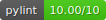
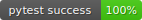
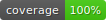
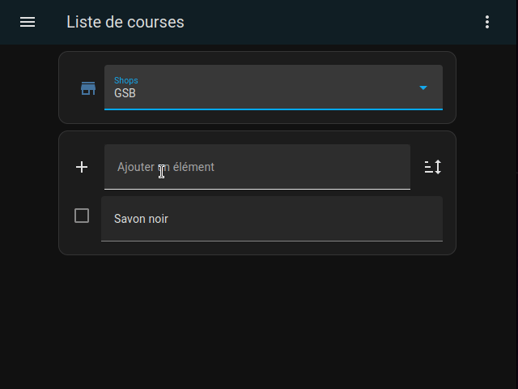

  

# Home Assistant Config

This repository is gathering the part of home assistant configuration and appdaemon script I want to share with the community.

## Appdaemon applications

[apps.yaml](appdaemon/apps.yaml) is showing how I configure the application listed bellow.

### Multiple shopping list manager

[Shopping list](https://www.home-assistant.io/integrations/shopping_list/) integration is only able to mange one shopping list. This application add teh capability the manage multiple shopping lists. Shopping list can be selected and updated indpendently and notification can be send when entering in a shop zone. One list can be associated to multiple zone.

Comment on the to of the script and [post on HomeAssitant forum](https://community.home-assistant.io/t/an-appdaemon-solution-for-multiple-shopping-list/608858?u=xavb) is explaining how to install and configure it. 

Pour les francophones, un [sujet sur le forum HACF](https://forum.hacf.fr/t/liste-de-courses-multiples-multiple-shopping-lists/27450) explique comment configurer cette application.

### Garage Door

This application is designed to raise and alarm is the garage door remain open when the night is coming or if door has been open by night and not closed within 15 minutes.

This automation required a sensor telling the open state of the door. In my case, I use a ZigBee sensor.

### Automower

This application is designed to perform and advanced management of a Husqvarna Automower.  
My weather station is able to detect rain. When rain occurs, this automation will ask automower to park. When rain as stop and lawn can be considered as dry, the application sends the order to restart mowing.
Thsi application is also managing the end of mowing session to ensure that session will not end into the next hour

### Notifier

[Notifier](https://github.com/jlpouffier/home-assistant-config/blob/master/appdaemon/apps/notifier.py) is a script originally written by jlpouffier. The version provided in this directory has been slightly updated for optimisation. I also created a test script to be sure that modification I add doesn't change to original behavior.

### Appdaemon testing

[Appdaemon-testing](https://github.com/nickw444/appdaemon-testing) is a framework designed to create unit test of appdaemon scripts. Even if the original version doesn't provides all the tools I need to fully test my scripts, I dicide to use it since it is easy to understand and easy to update.

The version provided into this repository is an improved version with additionnal tests functions. 